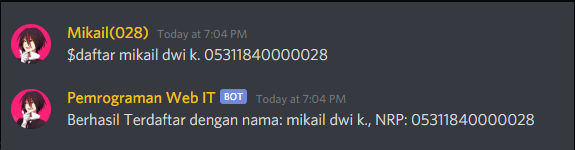

# Panduan Penggunaan Bot Pemrograman Web IT

Bot ini adalah program yang bisa digunakan untuk kegiatan pembelajaran dimana konsep yang digunakan adalah `Gamification` yaitu memberikan `Badge` kepada orang yang menyelesaikan task yang diberikan. Dengan adanya sistem `Gamification` diharapkan mahasiswa akan terpacu untuk mendapatkan `badge` terlebih dahulu dibandingkan dengan teman yang lain sehingga bisa mendongkrak kemauan belajar masing-masing siswa.

# Cara Daftar
r
## 1. Pertama, agar kalian dapat mengikuti badge system ini, daftarkan nama dan NRP anda dengan cara mengetikkan

```$daftar [NAMA] [NRP]``` 

pada channel `Pendaftaran.`

Contoh : `$daftar M. Mikail Dwi K. 05311840000028`



## 2. Badge Command

- Untuk mengetahui berapa banyak badge yang ada, gunakan command `$badgelist`
- Untuk mengetahui berapa badge yang telah kamu dapatkan, gunakan command `$mybadge`
- Untuk mengetahui berapa badge yang telah mahasiswa pemrograman web dapatkan gunakan `$badge`
- Untuk mengetahui cara mendapatkan badge, gunakan command `$badge [nama badge]` contoh: `$badge html5silver`

